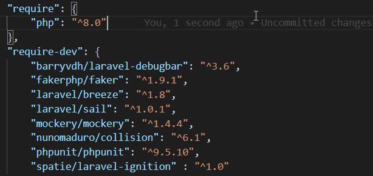

# VSCode Composer Intellisense

This [Visual Studio Code](https://code.visualstudio.com/) plugin offers intellisense for the PHP dependency manager [Composer](https://getcomposer.org/). 

## Features

- Autocomplete dependency names based on [Packagist](https://packagist.org/)
- Display currently installed package version next to package entry (on document save)
- Hover over package names to get insights about the package
- Hover over package names to get the currently installed and latest available package version

## Planned Features

- Command to install / update dependencies inline

## Requirements

You should have [Composer](https://getcomposer.org/) installed. But the plugin is actually not relying on it.

## Known Issues

- No known issues.

## Release Notes

### 0.7.0

**Reworked**

- Hover shows the latest version from packagist and the currently installed version if available
- Next to the package entry the latest available version is displayed in addition to the currently installed version

**Fixed**

- Extension behaves properly if no vendor folder is available

### 0.6.0

**Fixed**

- Extension behaviour adapted to work properly with latest version of VSCode

### 0.5.0

**Added**

- Hover over package names includes latest versions of package
- Cache for packagist API calls

### 0.4.0

**Added**

- Hover over package names to get insights about the installed package

### 0.3.0

**Added**

- Suggests package version based on the latest 20 versions with opinionated format `"^major.minor"`

### 0.2.0

**Added**

- Display currently installed package version on open and save of file

**Changed**
- Accepting autocomplete suggestion adds a snippet for the version number 

### 0.1.0

**Added**

- Autocomplete of package name `[Crtl+Space]`
